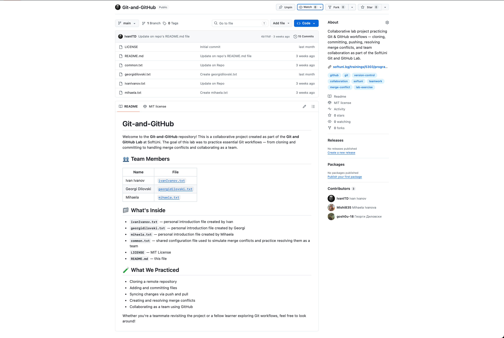
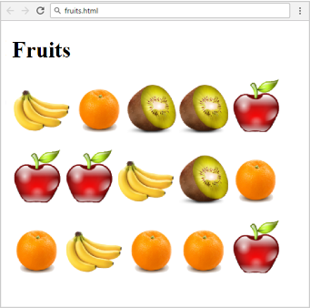

<h1>SoftUni <a href="https://softuni.bg/" class="button">Programming Fundamentals with JavaScript - Course Tasks 🚀</a></h1>
<h3>📖 About This Repository</h3>

Welcome to my <b>SoftUni Programming Fundamentals with JavaScript</b> repository! 👨‍💻

This repository contains all the tasks and solutions I've completed during the <b>Programming Fundamentals</b> course at SoftUni. Each solution reflects my journey of mastering the fundamentals of programming, building a strong foundation for future development.

<h3>🛠️ Tools and Technologies</h3>
<ul>
	<li><b>Programming Language:</b> JavaScript</li>
	<li><b>IDE:</b> VS Code</li>
	<li><b>Version Control:</b> Git & GitHub</li>
</ul>

<h3>🏆 Course Progress</h3>
<table border="1">
  <thead>
    <tr>
      <th>Topic</th>
      <th>Subcategory</th>
      <th>Status</th>
    </tr>
  </thead>
  <tbody>
    <tr>
      <td>Basic Syntax, Conditional Statements and Loops</td>
      <td>Lab</td>
      <td>✅ Completed</td>
    </tr>
    <tr>
      <td>Basic Syntax, Conditional Statements and Loops</td>
      <td>Exercise</td>
      <td>✅ Completed</td>
    </tr>
    <tr>
      <td>Basic Syntax, Conditional Statements and Loops</td>
      <td>More Exercises</td>
      <td>✅ Completed</td>
    </tr>
    <tr>
      <td>Git & GitHub</td>
      <td>Version Control</td>
      <td>✅ Completed</td>
    </tr>
    <tr>
      <td>Data Types and Variables</td>
      <td>Lab</td>
      <td>✅ Completed</td>
    </tr>
    <tr>
      <td>Data Types and Variables</td>
      <td>Exercise</td>
      <td>✅ Completed</td>
    </tr>
    <tr>
      <td>Data Types and Variables</td>
      <td>More Exercises</td>
      <td>✅ Completed</td>
    </tr>
    <tr>
      <td>HTTP Basics</td>
      <td>Lab</td>
      <td>✅ Completed</td>
    </tr>
    <tr>
      <td>Arrays</td>
      <td>Lab</td>
      <td>✅ Completed</td>
    </tr>
    <tr>
      <td>Arrays</td>
      <td>Exercise</td>
      <td>✅ Completed</td>
    </tr>
    <tr>
      <td>Arrays</td>
      <td>More Exercises</td>
      <td>✅ Completed</td>
    </tr>
    <tr>
      <td>HTML & CSS Basics</td>
      <td>Lab</td>
      <td>✅ Completed</td>
    </tr>
    <tr>
      <td>Functions</td>
      <td>Lab</td>
      <td>✅ Completed</td>
    </tr>
    <tr>
      <td>Functions</td>
      <td>Exercise</td>
      <td>✅ Completed</td>
    </tr>
    <tr>
      <td>Functions</td>
      <td>More Exercises</td>
      <td>✅ Completed</td>
    </tr>
    <tr>
      <td>Software Development Concepts - Part 1</td>
      <td>Lecture</td>
      <td>✅ Completed</td>
    </tr>
    <tr>
      <td>Arrays Advanced</td>
      <td>Lab</td>
      <td>✅ Completed</td>
    </tr>
    <tr>
      <td>Arrays Advanced</td>
      <td>Exercise</td>
      <td>✅ Completed</td>
    </tr>
    <tr>
      <td>Arrays Advanced</td>
      <td>More Exercises</td>
      <td>✅ Completed</td>
    </tr>
    <tr>
      <td>Mid Exam Preparation</td>
      <td>Practice</td>
      <td>✅ Completed</td>
    </tr>
    <tr>
      <td>Regular Mid Exam</td>
      <td>Exam</td>
      <td>✅ Completed</td>
    </tr>
    <tr>
      <td>Objects and Classes</td>
      <td>Lab</td>
      <td>✅ Completed</td>
    </tr>
    <tr>
      <td>Objects and Classes</td>
      <td>Exercise</td>
      <td>✅ Completed</td>
    </tr>
    <tr>
      <td>Objects and Classes</td>
      <td>More Exercises</td>
      <td>✅ Completed</td>
    </tr>
  </tbody>
</table>

<b>📋 Basic Syntax, Conditional Statements and Loops — More Exercises</b>

 
<table border="1">
  <thead>
    <tr>
      <th>#</th>
      <th>Task</th>
      <th>Status</th>
    </tr>
  </thead>
  <tbody>
    <tr>
      <td>1</td>
      <td>Sort Numbers</td>
      <td>✅</td>
    </tr>
    <tr>
      <td>2</td>
      <td>English Name of the Last Digit</td>
      <td>✅</td>
    </tr>
    <tr>
      <td>3</td>
      <td>Next Day</td>
      <td>✅</td>
    </tr>
    <tr>
      <td>4</td>
      <td>Reverse String</td>
      <td>✅</td>
    </tr>
    <tr>
      <td>5</td>
      <td>Distance Between Points</td>
      <td>✅</td>
    </tr>
  </tbody>
</table>

<b>📋 Git & GitHub — Version Control</b>

 

Referenced repo: <a href="https://github.com/IvanITD/Git-and-GitHub">Git-and-GitHub</a>

<table border="1">
  <thead>
    <tr>
      <th>#</th>
      <th>Topic</th>
      <th>Status</th>
    </tr>
  </thead>
  <tbody>
    <tr>
      <td>1</td>
      <td>Version control concepts — repo, clone, commit, push, pull, branch, merge</td>
      <td>✅</td>
    </tr>
    <tr>
      <td>2</td>
      <td>Git installation and CLI basics (Git Bash)</td>
      <td>✅</td>
    </tr>
    <tr>
      <td>3</td>
      <td>GitHub profile and repository setup</td>
      <td>✅</td>
    </tr>
    <tr>
      <td>4</td>
      <td>Cloning, committing, and pushing to remote</td>
      <td>✅</td>
    </tr>
    <tr>
      <td>5</td>
      <td>.gitignore configuration</td>
      <td>✅</td>
    </tr>
    <tr>
      <td>6</td>
      <td>Merge conflict resolution (TortoiseGit + Git Bash)</td>
      <td>✅</td>
    </tr>
    <tr>
      <td>7</td>
      <td>Team collaboration — shared repo with 3 members</td>
      <td>✅</td>
    </tr>
  </tbody>
</table>

<b>Team members:</b> Ivan Ivanov, Georgi Dilovski, Mihaela Ivanova
  
<table>
  <tr>
    <td><b>Repository Preview</b></td>
  </tr>
  <tr>
    <td></td>
  </tr>
</table>

<b>📋 Data Types and Variables — More Exercises</b>

 
<table border="1">
  <thead>
    <tr>
      <th>#</th>
      <th>Task</th>
      <th>Status</th>
    </tr>
  </thead>
  <tbody>
    <tr>
      <td>1</td>
      <td>Digits with Words</td>
      <td>✅</td>
    </tr>
    <tr>
      <td>2</td>
      <td>Prime Number Checker</td>
      <td>✅</td>
    </tr>
    <tr>
      <td>3</td>
      <td>Cone</td>
      <td>✅</td>
    </tr>
    <tr>
      <td>4</td>
      <td>Biggest of 3 Numbers</td>
      <td>✅</td>
    </tr>
    <tr>
      <td>5</td>
      <td>Binary to Decimal</td>
      <td>✅</td>
    </tr>
    <tr>
      <td>6</td>
      <td>Chess Board</td>
      <td>✅</td>
    </tr>
    <tr>
      <td>7</td>
      <td>Triangle Area</td>
      <td>✅</td>
    </tr>
  </tbody>
</table>

<b>📋 HTTP Basics — Lab</b>

 
<table border="1">
  <thead>
    <tr>
      <th>#</th>
      <th>Topic</th>
      <th>Status</th>
    </tr>
  </thead>
  <tbody>
    <tr>
      <td>1</td>
      <td>GET vs POST — HTML form example (<code>example.html</code>)</td>
      <td>✅</td>
    </tr>
    <tr>
      <td>2</td>
      <td>Postman + apipheny — GET requests</td>
      <td>✅</td>
    </tr>
    <tr>
      <td>3</td>
      <td>Postman POST — <code>https://postman-echo.com/post</code> with JSON body</td>
      <td>✅</td>
    </tr>
    <tr>
      <td>4</td>
      <td>HTTP Response structure (status line, headers, body)</td>
      <td>✅</td>
    </tr>
    <tr>
      <td>5</td>
      <td>Status codes via Dev Tools (SoftUni website)</td>
      <td>✅</td>
    </tr>
    <tr>
      <td>6</td>
      <td>Common HTTP status codes (1xx–5xx)</td>
      <td>✅</td>
    </tr>
    <tr>
      <td>7</td>
      <td>MIME types</td>
      <td>✅</td>
    </tr>
    <tr>
      <td>8</td>
      <td>URLs structure and components</td>
      <td>✅</td>
    </tr>
  </tbody>
</table>

<b>📋 Arrays — More Exercises</b>

 
<table border="1">
  <thead>
    <tr>
      <th>#</th>
      <th>Task</th>
      <th>Status</th>
    </tr>
  </thead>
  <tbody>
    <tr>
      <td>1</td>
      <td>Print N-th Element</td>
      <td>✅</td>
    </tr>
    <tr>
      <td>2</td>
      <td>Add and Remove</td>
      <td>✅</td>
    </tr>
    <tr>
      <td>3</td>
      <td>Rotate Array</td>
      <td>✅</td>
    </tr>
    <tr>
      <td>4</td>
      <td>Non-Decreasing Subset</td>
      <td>✅</td>
    </tr>
    <tr>
      <td>5</td>
      <td>Tseam Account</td>
      <td>✅</td>
    </tr>
    <tr>
      <td>6</td>
      <td>Magic Matrices</td>
      <td>✅</td>
    </tr>
    <tr>
      <td>7</td>
      <td>Spiral Matrix</td>
      <td>✅</td>
    </tr>
    <tr>
      <td>8</td>
      <td>Diagonal Attack</td>
      <td>✅</td>
    </tr>
    <tr>
      <td>9</td>
      <td>Orbit</td>
      <td>✅</td>
    </tr>
  </tbody>
</table>

<b>📋 HTML & CSS Basics — Lab</b>

 
<table border="1">
  <thead>
    <tr>
      <th>#</th>
      <th>Task</th>
      <th>Status</th>
    </tr>
  </thead>
  <tbody>
    <tr>
      <td>1</td>
      <td>Welcome to HTML</td>
      <td>✅</td>
    </tr>
    <tr>
      <td>2</td>
      <td>SoftUni Logo</td>
      <td>✅</td>
    </tr>
    <tr>
      <td>3</td>
      <td>Fruits</td>
      <td>✅</td>
    </tr>
    <tr>
      <td>4</td>
      <td>HTML Lists</td>
      <td>✅</td>
    </tr>
    <tr>
      <td>5</td>
      <td>Wiki Page</td>
      <td>✅</td>
    </tr>
    <tr>
      <td>6</td>
      <td>Color Blocks</td>
      <td>✅</td>
    </tr>
  </tbody>
</table>

 

| Task | Preview |
|------|---------|
| Welcome to HTML |  |
| Fruits |  |
| HTML Lists |  |
| Wiki Page |  |
| Color Blocks |  |

<b>📋 Functions — More Exercises</b>

 
<table border="1">
  <thead>
    <tr>
      <th>#</th>
      <th>Task</th>
      <th>Status</th>
    </tr>
  </thead>
  <tbody>
    <tr>
      <td>1</td>
      <td>Car Wash</td>
      <td>✅</td>
    </tr>
    <tr>
      <td>2</td>
      <td>Number Modification</td>
      <td>✅</td>
    </tr>
    <tr>
      <td>3</td>
      <td>Points Validation</td>
      <td>✅</td>
    </tr>
    <tr>
      <td>4</td>
      <td>Radio Crystals</td>
      <td>✅</td>
    </tr>
    <tr>
      <td>5</td>
      <td>Print DNA</td>
      <td>✅</td>
    </tr>
  </tbody>
</table>

<b>📋 Software Development Concepts — Part 1</b>

 
<table border="1">
  <thead>
    <tr>
      <th>#</th>
      <th>Topic</th>
      <th>Status</th>
    </tr>
  </thead>
  <tbody>
    <tr>
      <td>1</td>
      <td>4 Skills of Software Engineers</td>
      <td>✅</td>
    </tr>
    <tr>
      <td>2</td>
      <td>Math Concepts in Software Development</td>
      <td>✅</td>
    </tr>
    <tr>
      <td>3</td>
      <td>Object-Oriented Programming (OOP)</td>
      <td>✅</td>
    </tr>
    <tr>
      <td>4</td>
      <td>Inheritance and Interfaces</td>
      <td>✅</td>
    </tr>
    <tr>
      <td>5</td>
      <td>Functional Programming (FP)</td>
      <td>✅</td>
    </tr>
    <tr>
      <td>6</td>
      <td>Lambda and First-Class Functions</td>
      <td>✅</td>
    </tr>
    <tr>
      <td>7</td>
      <td>Higher-Order Functions</td>
      <td>✅</td>
    </tr>
    <tr>
      <td>8</td>
      <td>Data Structures and Algorithms</td>
      <td>✅</td>
    </tr>
    <tr>
      <td>9</td>
      <td>Component-Based Development</td>
      <td>✅</td>
    </tr>
    <tr>
      <td>10</td>
      <td>Event-Driven Programming</td>
      <td>✅</td>
    </tr>
    <tr>
      <td>11</td>
      <td>Software Architectures</td>
      <td>✅</td>
    </tr>
    <tr>
      <td>12</td>
      <td>Front-End and Back-End</td>
      <td>✅</td>
    </tr>
    <tr>
      <td>13</td>
      <td>Full Stack Development</td>
      <td>✅</td>
    </tr>
  </tbody>
</table>

<b>📋 Arrays Advanced — More Exercises</b>

 
<table border="1">
  <thead>
    <tr>
      <th>#</th>
      <th>Task</th>
      <th>Status</th>
    </tr>
  </thead>
  <tbody>
    <tr>
      <td>1</td>
      <td>Equal Neighbors</td>
      <td>✅</td>
    </tr>
    <tr>
      <td>2</td>
      <td>Bunny Kill</td>
      <td>✅</td>
    </tr>
    <tr>
      <td>3</td>
      <td>Air Pollution</td>
      <td>✅</td>
    </tr>
    <tr>
      <td>4</td>
      <td>Jan's Notation</td>
      <td>✅</td>
    </tr>
    <tr>
      <td>5</td>
      <td>Kate's Way Out</td>
      <td>✅</td>
    </tr>
    <tr>
      <td>6</td>
      <td>Rosetta Stone</td>
      <td>✅</td>
    </tr>
  </tbody>
</table>

<b>📋 Mid Exam Preparation — Tasks</b>

 
<table border="1">
  <thead>
    <tr>
      <th>#</th>
      <th>Task</th>
      <th>Status</th>
    </tr>
  </thead>
  <tbody>
    <tr>
      <td>1</td>
      <td>Guinea Pig</td>
      <td>✅</td>
    </tr>
    <tr>
      <td>2</td>
      <td>Shopping List</td>
      <td>✅</td>
    </tr>
    <tr>
      <td>3</td>
      <td>Memory Game / Heart Delivery</td>
      <td>✅</td>
    </tr>
  </tbody>
</table>

<b>📋 Regular Mid Exam — Tasks</b>

 
<table border="1">
  <thead>
    <tr>
      <th>#</th>
      <th>Task</th>
      <th>Status</th>
    </tr>
  </thead>
  <tbody>
    <tr>
      <td>1</td>
      <td>Experience Gaining</td>
      <td>✅</td>
    </tr>
    <tr>
      <td>2</td>
      <td>Tax Calculator</td>
      <td>✅</td>
    </tr>
    <tr>
      <td>3</td>
      <td>Phone Shop</td>
      <td>✅</td>
    </tr>
  </tbody>
</table>

<b>📋 Objects and Classes — More Exercises</b>

 
<table border="1">
  <thead>
    <tr>
      <th>#</th>
      <th>Task</th>
      <th>Status</th>
    </tr>
  </thead>
  <tbody>
    <tr>
      <td>1</td>
      <td>Class Laptop</td>
      <td>✅</td>
    </tr>
    <tr>
      <td>2</td>
      <td>Flight Schedule</td>
      <td>✅</td>
    </tr>
    <tr>
      <td>3</td>
      <td>School Register</td>
      <td>✅</td>
    </tr>
    <tr>
      <td>4</td>
      <td>Browser History</td>
      <td>✅</td>
    </tr>
    <tr>
      <td>5</td>
      <td>Sequences</td>
      <td>✅</td>
    </tr>
  </tbody>
</table>

<h3>🌟 Get in Touch</h3>

If you have any questions, feedback, or suggestions, feel free to reach out to me via:

<ul>
	<li><b>GitHub Profile:</b> <a href="https://github.com/IvanITD" class="button">IvanITD</a></li>
	<li><b>LinkedIn:</b> <a href="https://www.linkedin.com/in/ivanivanovofficial" class="button">Ivan Ivanov</a></li>
</ul>

This repository reflects my ongoing progress in the <b>SoftUni Programming Fundamentals with JavaScript</b> course. Thank you for visiting and happy coding! 😊

